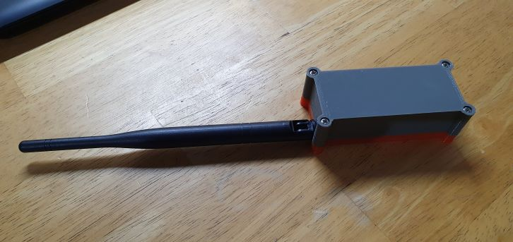

# Enclosure
This case was designed to wrap the RAK5005 dev board with space for a 400mAh LiPo battery (30x30x10 mm) a latch power switch and a knuckle whip antenna. 
Uses M3 25mm screws to close the lid. You can find the power switch here https://www.electrodragon.com/product/88-lock-non-homing-switch/

#### 

